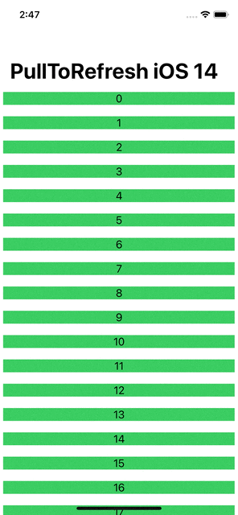
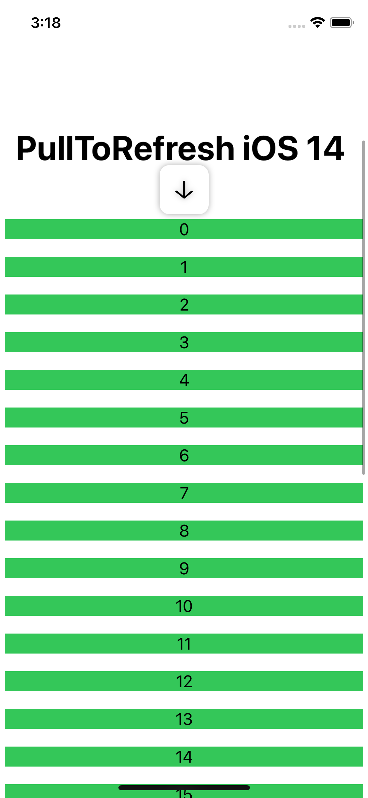
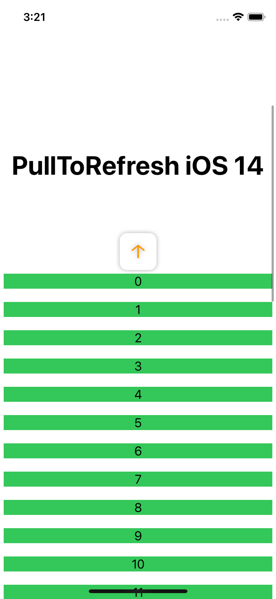
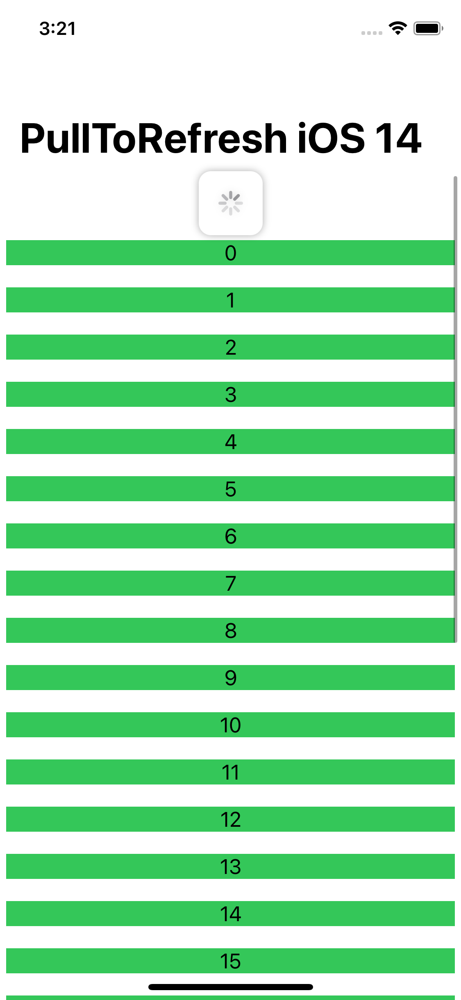

# PullToRefresh for iOS 14+ - SwiftUI


An example of pull to refresh funcionality on SwiftUI for iOS 14+. **100% SwiftUI**. No UIKit usage. 

<p align="center">
    
</p>

This modifier mimics the [refreshable modifier](https://developer.apple.com/documentation/swiftui/label/refreshable(action:)) functionality. It can take async tasks and shows a progressView when calling the task.

|  |  |  |
| ------------------------------------------------------------ | ------------------------------------------------------------ | ------------------------------------------------------------ |

## Usage

Just copy the `PullToRefreshModifier.swift` file in your project and use the modifier like this:

```swift
        NavigationView {
            ScrollView {
		   ...
                }
                .pullToRefresh {
                    await asyncTask()
                }
        }
```

You have to apply the pullToRefresh modifier to ScrollView or any view inside of it.

*Work is in progress to support iOS 13.*

